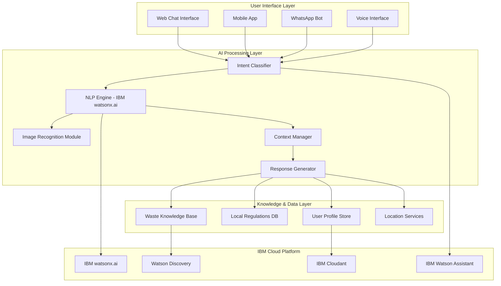
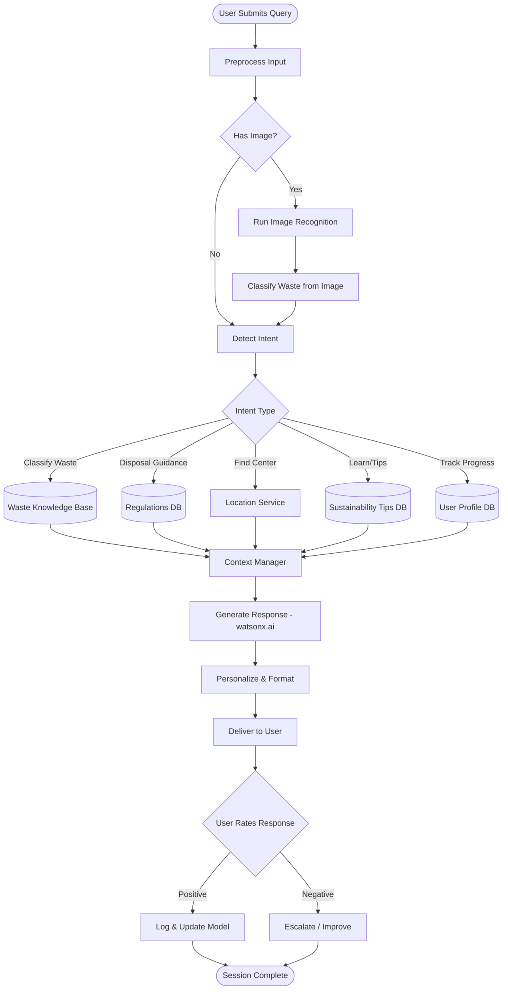

# 🌿 EcoSort AI Agent
### Smart Waste Segregation and Disposal Assistant

> An AI-powered conversational agent that helps users identify waste categories, provides step-by-step disposal guidance, and promotes sustainable waste management practices — built using IBM watsonx.ai and IBM Watson Assistant.

---

## 📌 Project Overview

**EcoSort AI Agent** addresses one of the world's most pressing environmental challenges: improper waste segregation. By leveraging conversational AI, natural language processing, and computer vision, EcoSort guides individuals, households, schools, and small businesses toward correct waste disposal — instantly, in multiple languages, 24/7.

This project was developed as part of the **IBM SkillsBuild + AICTE AI for Sustainability Internship**.

| | |
|---|---|
| **Project Title** | EcoSort AI Agent – Smart Waste Segregation and Disposal Assistant |
| **SDG Alignment** | SDG 12 – Responsible Consumption and Production |
| **Submitted by** | Kunja Bihari Bagh |
| **College** | GIET University, Gunupur |
| **Program** | IBM SkillsBuild + AICTE – AI for Sustainability Internship |
| **Date** | June 2026 |

---

## 🎯 Problem Statement

Despite growing environmental awareness, most people lack practical knowledge to segregate waste correctly. Waste categories are complex, disposal rules vary by location, information is scattered and not multilingual, and there is no real-time guidance available at the moment a disposal decision is made. The result: recyclable materials end up in landfills, hazardous waste is disposed of unsafely, and valuable resources are permanently lost.

**EcoSort AI Agent** solves this by providing an intelligent, conversational, always-available waste management guide.

---

## 🌍 SDG 12 Alignment

| Target | Description | EcoSort Contribution |
|--------|-------------|----------------------|
| 12.2 | Sustainable management of natural resources | Promotes recycling, reducing raw material demand |
| 12.3 | Reduce food waste across supply chains | Guides organic waste composting and food disposal |
| 12.4 | Responsible chemical & hazardous waste management | Specific guidance on safe disposal of toxic materials |
| 12.5 | Substantially reduce waste generation | Educates users on Reduce → Reuse → Recycle |
| 12.8 | Universal awareness for sustainable lifestyles | AI-powered education accessible to all, in any language |

---

## 🎯 Objectives

- Classify waste materials via text description or image upload
- Provide step-by-step, location-specific disposal guidance
- Support 8 waste categories: organic, recyclable, hazardous, e-waste, biomedical, construction, sanitary, inert
- Deliver multilingual support across 10+ Indian languages
- Educate users on the environmental impact of disposal choices
- Drive long-term behavior change through gamification (EcoScore, badges, challenges)

---

## 🏗️ System Architecture

EcoSort follows a three-layer architecture:

---

## 🔄 Agent Workflow

---

## 🤖 AI Technologies Used

| Technology | Purpose |
|------------|---------|
| **IBM watsonx.ai** (Granite-13b-chat) | Core LLM for natural language understanding & generation |
| **IBM Watson Assistant** | Dialog management, intent recognition, multi-channel deployment |
| **Computer Vision (watsonx.ai Vision)** | Waste image classification |
| **IBM Watson Discovery** | Knowledge base retrieval (RAG) |
| **IBM Cloudant** | User profile & session storage |
| **Python + FastAPI** | Backend API layer |
| **React.js + Tailwind CSS** | Frontend chat interface |

---

## 👥 Target Users

- Urban households seeking daily disposal guidance
- Students & youth for sustainability education
- Small businesses for waste compliance
- Housing societies for community waste management
- Eco-conscious individuals for progress tracking

---

## 🛡️ Responsible AI Framework

| Pillar | Approach |
|--------|----------|
| **Fairness** | Multilingual support (10+ languages), WCAG 2.1 AA accessibility, free disposal options always suggested |
| **Transparency** | Explains classification reasoning, discloses confidence levels, identifies itself as AI |
| **Ethics** | Environmental safety prioritized, no greenwashing, hazardous waste escalation |
| **Privacy** | Data minimization, anonymized logs, GDPR & India PDPB compliant |

---

## 📊 Expected Impact

| Metric | Year 1 Target | Year 3 Target |
|--------|---------------|----------------|
| Waste correctly segregated | 50,000 tonnes | 500,000 tonnes |
| Recycling rate improvement | +5% | +15% |
| Landfill diversion | 10,000 tonnes | 100,000 tonnes |
| Carbon emissions saved | 5,000 tonnes CO₂e | 50,000 tonnes CO₂e |

---

## 💬 Sample Interaction

> **User:** Can I put a pizza box in the recycling bin?
>
> **EcoSort:** Not the whole box. Grease and food residue contaminate the recycling stream.
> 1. Tear off the clean top half → **blue recycling bin**
> 2. Greasy bottom half → **general / wet waste bin**
>
> *Confidence: High · Category: Mixed (Recyclable + Organic)*

More sample interactions and chatbot screenshots are available in the full project report.

---

## 🚀 Future Enhancements

- AR camera mode for instant waste identification
- Smart bin IoT sensor integration
- Voice interface & smart speaker support
- Corporate ESG waste analytics dashboard
- Expansion to 25+ languages globally

---

## 📁 Repository Contents

| File | Description |
|------|-------------|
| `EcoSort_AI_Project_Report.docx` | Complete project report (architecture, workflows, responsible AI, impact, sample outputs) |
| `EcoSort_AI_Presentation.pptx` | 12-slide presentation with presenter notes |

---

## 📜 Conclusion

EcoSort AI Agent demonstrates that responsible, accessible AI can drive real behavioral change at scale — helping users make sustainable waste decisions every day. By combining IBM watsonx.ai's foundation models with Watson Assistant's conversational framework, this project shows a practical, scalable path toward achieving UN SDG 12: Responsible Consumption and Production.

---

## 👤 Author

**Kunja Bihari Bagh**
GIET University, Gunupur
IBM SkillsBuild + AICTE — AI for Sustainability Internship 2026

---

*This project was developed as part of the IBM SkillsBuild + AICTE AI for Sustainability Internship program.*
